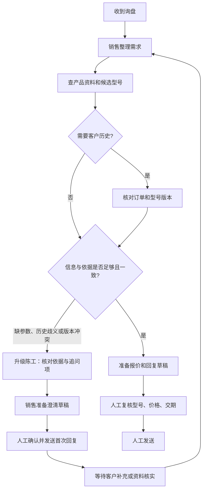

# 模拟场景流程图

来源：`data/session-notes.md` 中 O001–O006、E01、E03；图中的分支是这些模拟记录的归纳，不代表真实客户流程已获验证。详细职责与逐行证据见六项交付物中的 As-Is Workflow 和 Decision Map。

销售主动处理时长只累计实际操作，不把等待客户或等待工程师全部计作劳动投入。首次实质回复可能停在澄清环节，因此不能把首次回复时间当作最终报价完成时间。
