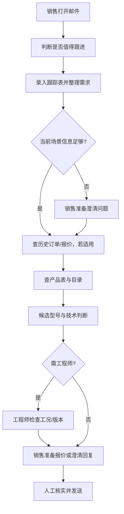

# As-Is Workflow V1 · 模拟观察

| 节点 | 已观察/主张 | 系统或材料 | 分支与异常 | 证据 |
|---|---|---|---|---|
| 客户有效性 | Linda 演示会先判断；维度的预测力未验证 | 邮箱、公司、项目描述 | 不按国家/私人邮箱自动拒绝 | S2-E02、S2-E03 |
| 需求录入 | 展示跟踪 Excel 字段 | Customer Inquiry Tracking.xlsx | 缺字段与场景相关 | S2-E04 |
| 候选查询 | 展示 CP80/CP90/CP100 | Pump Selection.xlsx | CP80 边缘的说法缺曲线证据 | S2-E05 |
| 技术判断 | 陈工描述多因素判断 | 曲线、Excel、经验 | 缺介质/材质/版本时升级 | S2-E04、S2-E06 |
| 历史上下文 | 销售称老客户会看历史报价 | ERP、历史报价 | 身份和订单关联待验证 | S2-E10 |
| 回复与发送 | 人工处理 | 邮件 | 澄清回复与最终报价分开 | S2-E01、S2-E09 |

**计时空白。** 本次没有 #017 的完整开始/结束时间戳。Linda 的 15 分钟/30 分钟及“可能等到第二天”不能直接填进 Baseline。下一轮应分别记录主动工作、队列等待、工程师工作、首封有意义回复和最终报价时间。[S2-E07](../data/meeting-record.md)
