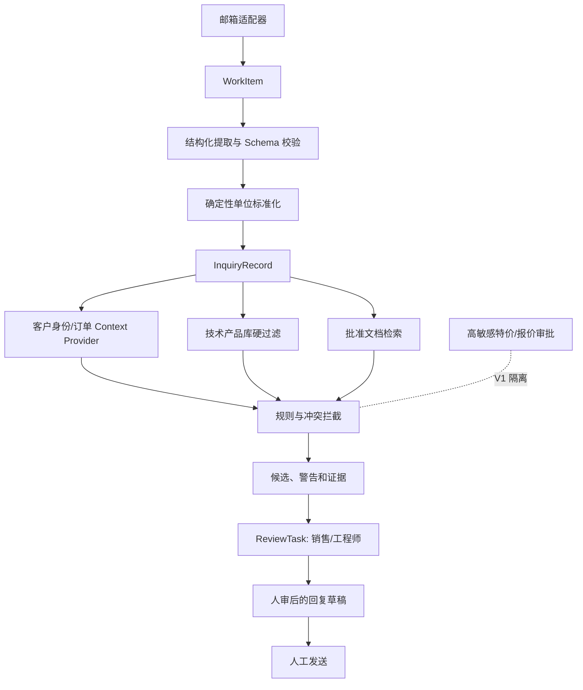

# Architecture V0 · 设计图

隔离点：原始聊天只进入规则候选队列；已批准技术字段和知识才能进入查询；客户身份歧义停止自动关联；冲突字段阻断候选确认；特价不进入生成上下文。推荐必须携带来源、版本和风险；审核结果回写评估与规则问题单，不自动修改权威来源。

模块边界供 Stage 4 设计审查参考：`ingestion`、`extraction`、`normalization`、`entities/context`、`products`、`rules`、`retrieval`、`recommendations`、`review`、`evals`。这是接口建议，不预设数据库或模型供应商。
