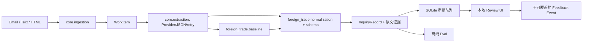

# Architecture Review · 第一版工程边界

代码位于 `src/fde_platform/`。`core` 只了解 WorkItem、Provider 协议、JSON 重试、存储和日志；`domains/foreign_trade` 定义泵询盘字段、离线提取基线、单位与业务校验。`apps/review_web` 展示和编辑记录。`evals` 从领域记录比较标签。依赖方向是应用 → 领域 → 核心，核心不导入工业泵或海川租户配置。

抽取失败最多重试一次，之后以 `failed` 入审核队列；原始输出、错误、trace ID、版本和本机耗时写入本地 telemetry。这里的重试只针对 JSON 解析/提供者失败，不盲目重试数值或证据校验失败；这些错误进入人工复核以保留原因。生产模型接入时需另做请求超时、限流、脱敏、凭证和数据处理评审。

单位由确定性代码计算。模型或基线只返回原始值、单位和证据片段，不能返回已“猜好”的标准值。WorkItem 的邮件时间缺失时也保留 `null`，不得填当前时间。最终 InquiryRecord 的缺失字段采用 `null`，人工更正事件保存 `model_record` 与 `corrected_record`；被更正字段的来源标记为 `human_review`，不再伪装成模型原文证据。

**设计评审结论。** 这条边界可支撑未来替换 Provider，亦可给别的领域复用核心；当前仅实现教学所需模块，不构建通用多租户平台。Review UI 仅本机单用户，不能处理真实敏感客户资料。Prompt 有独立文件及版本号，但正则基线不使用 Prompt；此事实应在 PR 和评估报告中明确。
