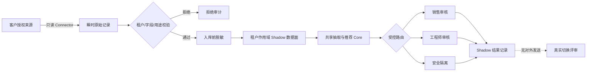

# Stage 10：真实客户接入准备与受控 Shadow Pilot

本阶段回答一个比“模型能不能跑”更具体的问题：怎样在有授权、可撤销、可审计的前提下，把新客户数据映射到共享 Core，并先让结果只对内部审核人可见。

仓库中的 `design-partner-alpha` 是虚构的设计合作客户。它模拟真实切换步骤，但不含真实客户、联系人、系统凭据、合同或生产数据。本地数据面明确拒绝 `authorized_customer_data` 模式，防止把教学命令误用于真实数据。

## 本阶段交付

- 哈希绑定的客户授权清单：用途、来源、字段、保留期、地域、模型与自动动作边界由数据负责人和 FDE 安全负责人签同一版本。
- 只读 JSONL Connector：模拟邮箱/CRM 拉取边界，并把幂等责任留给持久化数据面。
- 入库前隐私过滤：联系人和公司使用租户作用域 HMAC 标识，正文中的邮箱与电话被替换；跨租户和未授权字段被拒绝。
- 影子数据面：验证事件去重、连续版本、更新重开、审核负责人、访问审计和保留期清理。
- 共享 Core 复用：继续调用 Stage 4/5 的 `WorkItem → Extraction → InquiryRecord → Recommendation`，客户差异保留在清单、映射、隐私策略、Scope 与分派规则中。
- 人工工作流：提示注入隔离，资料缺失请求澄清，规则或候选风险交工程师；无发送、报价和派工实现。
- 真实切换门：列出生产数据面、企业身份、外部凭据、数据处理协议和 Stop Owner 等缺口，不用合成结果替代真实批准。



## 10 分钟复现

从仓库根目录执行：

```bash
python3 stage10.py validate-package
python3 stage10.py demo --check-baseline
python3 stage10.py readiness
```

检查 `outputs/stage-10/stage10-report.md`。基线应显示 5 个新来源、1 个版本更新、1 次重复投递、2 条边界拒绝；保留期清理后 4 个案例均完成模拟人工审核，对外副作用为 0，真实客户数据为 0，真实 Pilot Gate 为 `NOT_EVALUATED`。

## 自己扮演审核人

先用单独目录准备队列：

```bash
python3 stage10.py prepare --output outputs/my-stage10
cat outputs/my-stage10/identity/training-credentials.json
python3 stage10.py login --output outputs/my-stage10 --actor dp-engineer-wu --password '<训练密码>'
python3 stage10.py queue --output outputs/my-stage10 --token '<令牌>'
python3 stage10.py review --output outputs/my-stage10 --token '<令牌>' --case DP-001 --action accept --reason '已核对字段证据与候选边界'
python3 stage10.py purge --output outputs/my-stage10
python3 stage10.py report --output outputs/my-stage10
```

`dp-sales-lin` 只能处理分给销售的案例，`dp-engineer-wu` 只能处理工程师案例。令牌有签名、租户、角色和有效期，但仍是本机教学身份，不是企业 SSO。

## 数据更新与失败练习

`DP-002` 的版本 1 缺扬程，版本 2 补齐并重新打开同一个案例。相同 `event_id` 和相同净化内容会被去重；相同 ID 内容变化、跳版本、跨租户、禁止字段都会失败。`DP-003` 含越权指令，只生成隔离产物。`DP-005` 超过 30 天，来源、案例和审核记录一起清理。

复制清单和 JSONL 到 `outputs/` 后做以下修改：

| 修改 | 预期结果 |
|---|---|
| 修改 `retention_days`，不重签哈希 | 拒绝：两位负责人未签同一内容版本 |
| 给事件增加 `bank_account` | 拒绝：禁止字段，不落数据面 |
| 把来源版本从 1 跳到 3 | 拒绝：版本不连续 |
| 把 `tenant_id` 换成别的客户 | 拒绝并留下越权审计 |
| 把清单模式改成 `authorized_customer_data` | 本地数据面拒绝，即使清单结构有效 |
| 让销售审核工程师任务 | 拒绝：当前身份不是负责人 |

## 接入真实客户时怎样复用

保留 `WorkItem`、抽取、领域 Schema、推荐契约、路由动作、审核事件和评估接口。为每位客户单独实现以下薄层：

1. 外部保存授权证据和清单；仓库只保存不含秘密的 Schema 或示例。
2. 实现客户来源的只读 Connector，将原字段映射为版本化事件。
3. 在客户批准的地域部署加密生产数据面、密钥管理、备份和删除任务。
4. 将企业 IdP 的租户和角色 Claims 映射到审核角色，禁用本地教学身份。
5. 用客户代表样本重新评估抽取、引用、弃答、安全、延迟和成本。
6. 先 Shadow，只比较系统建议与真人决定；批准后才能另行设计待发送区，仍不直接自动发送。

逐项操作见[真实客户切换手册](guides/real-customer-cutover.md)，授权与责任分工见[接入检查表](templates/customer-onboarding-checklist.md)。机器可读起点包括[真实客户清单示例](templates/authorized-customer-manifest.example.json)和[来源事件契约](templates/connector-event.schema.json)；示例中的 `REPLACE` / `pending` 值故意不能通过生产评审。

个人信息处理应围绕明确目的、最少范围、保存期限与安全措施设计；跨境处理需要单独核对适用条件和批准。参考[《个人信息保护法》官方文本](https://www.npc.gov.cn/npc/c2/c30834/202108/t20210820_313088.html)、[国家网信办关于数据跨境流动规定的官方发布](https://www.cac.gov.cn/2024-03/22/c_1712776612187994.htm)及[GDPR Article 5 官方文本](https://eur-lex.europa.eu/legal-content/EN/TXT/?toc=OJ%3AL%3A2016%3A119%3AFULL&uri=uriserv%3AOJ.L_.2016.119.01.0001.01.ENG)。项目负责人仍需让客户法务、安全和数据负责人按实际地域与数据类型作出决定。

## 完成标准

合成演练完成以回归报告为准。真实数据切换只有在 `readiness` 全部通过、清单与证据由授权人签核、生产组件经安全评审、Stop/Rollback 负责人明确后，才进入生产切换评审。`READY_FOR_PRODUCTION_CUTOVER_REVIEW` 仍只是可开评审，不等于获准上线。
