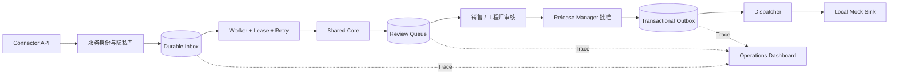

# Stage 11：Production-like Delivery Room

本阶段把前十阶段的离线能力放进一个可持续运行的教学运行时：入站请求先经服务身份、租户和隐私门，进入持久化 Inbox；Worker 使用共享 Core 处理；销售或工程师审核；另一位 Release Manager 批准；事务性 Outbox 只允许投递到本机 Mock Sink。每一步都能通过 Trace、指标和事故记录还原。

它是生产形态参考实现。存储仍是 SQLite，身份仍是本机签名身份，案例与五个班次由脚本合成，实际用户和真实客户投递均为 0。

## 本阶段交付

- 46 次入站：36 个来源、4 个版本更新、6 次完全重复投递。
- 持久化 Inbox、连续来源版本、Worker 租约、指数退避、死信和重启恢复。
- 35 个可处理案例的角色审核；1 个 Schema 漂移事件经过三次尝试进入死信。
- 审核人与 Release Manager 分离；未经批准的 Outbox 不能投递。
- 27 条模拟 Outbox：一次 429 后恢复，一次持续 503 后进入死信，其余投递到 Mock Sink。
- 本机 HTTP API、浏览器只读控制台、独立 Mock OAuth/客户端点和 Docker 启动方式。
- 队列、Trace、指标、隐私扫描、事故记录、Runbook、UAT 和项目治理材料。



## 一键回归

在仓库根目录执行：

```bash
python3 stage11.py demo --check-baseline
python3 -m unittest tests.test_stage11_delivery_room -v
```

打开 `outputs/stage-11/stage11-report.md`。预期结果包括：Worker 完成 39 个版本事件、1 个死信、3 次 Retry 状态；35 个案例完成审核；26 次 Mock 投递、1 个 Outbox 死信；真实投递、未批准投递、跨租户成功和持久化直接标识符均为 0。

## 手动扮演运行团队

准备并处理入站：

```bash
python3 stage11.py prepare --output outputs/my-stage11
python3 stage11.py work --output outputs/my-stage11
cat outputs/my-stage11/identity/training-credentials.json
```

用负责人账号登录并审核。以下密码从上一步文件读取：

```bash
python3 stage11.py login --output outputs/my-stage11 --actor dp-engineer-wu --password '<训练密码>'
python3 stage11.py queue --output outputs/my-stage11 --token '<工程师令牌>'
python3 stage11.py review --output outputs/my-stage11 --token '<工程师令牌>' --case DR-001 --action accept --reason '已核对证据、规则与候选边界'
```

审核返回 `message_id` 后，由不同身份批准：

```bash
python3 stage11.py login --output outputs/my-stage11 --actor dp-release-li --password '<训练密码>'
python3 stage11.py approve --output outputs/my-stage11 --token '<发布经理令牌>' --message '<message_id>'
```

在第一个终端启动本机 Mock OAuth 和客户端点，在第二个终端投递：

```bash
python3 stage11_mock_server.py --output outputs/my-stage11/mock-deliveries.json
python3 stage11.py dispatch --output outputs/my-stage11
```

查看单案例链路和指标：

```bash
python3 stage11.py trace --output outputs/my-stage11 --token '<任一当前租户令牌>' --case DR-001
python3 stage11.py dashboard --output outputs/my-stage11 --token '<任一当前租户令牌>'
```

## 长期服务和控制台

先启动 `stage11_mock_server.py`，再执行：

```bash
python3 stage11.py serve --output outputs/my-stage11
```

访问 `http://127.0.0.1:8781/`。API 服务会在后台轮询 Worker 和 Dispatcher；浏览器控制台需要粘贴登录所得令牌。API 契约见[接口与架构说明](guides/api-and-architecture.md)。

也可用容器启动：

```bash
docker compose -f stages/11-delivery-room/docker-compose.yml up --build
```

容器仅把 API 暴露在宿主机 `127.0.0.1:8781`，Mock Sink 仍留在同一容器的 loopback。数据写入命名卷。

## 事故练习

- `DR-E005-V1`：上下文依赖首次超时，退避后成功。
- `DR-E017-V1`：模拟必需字段发生无法映射的 Schema 漂移，三次失败后进入 Worker Dead Letter。
- 第一条 Outbox：模拟 429，退避后成功。
- 最后一条 Outbox：模拟持续 503，三次失败后进入 Outbox Dead Letter，并把案例标记为 `delivery_failed`。

按[运行与值班手册](guides/operator-runbook.md)处理，再用[事故演练](guides/incident-drill.md)记录发现、止损、恢复和复盘。

## 完成边界

本阶段完成表示生产形态控制在合成环境中可运行。转入真实客户环境仍需要 PostgreSQL 或获批生产数据面、企业 SSO、密钥管理、备份恢复、漏洞与依赖扫描、基础设施即代码、真实 SLO、客户 UAT 和现场值班。真实 Pilot Gate 保持 `NOT_EVALUATED`。

运行风险治理可参考 [NIST AI RMF Playbook](https://www.nist.gov/itl/ai-risk-management-framework/nist-ai-rmf-playbook)；提示注入、敏感信息披露和输出处理用例可继续参考 [OWASP LLM Top 10](https://genai.owasp.org/llm-top-10/)。这些资料是检查骨架，不能代替客户安全、法务和领域负责人的判断。
