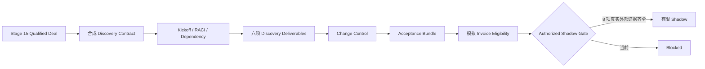

# Stage 17：Paid Discovery Delivery & Acceptance

本阶段把 Stage 15 的商务方案和 Stage 16 的团队能力继续推进到一条完整的“合同生效 → Kickoff → 依赖管理 → 交付 → 变更 → 客户验收 → 开票条件 → 下一 Gate”链路。

为了不伪造客户事实，参考案例使用 `counterfactual_training_branch`：它假设海川教学客户签署了一份合成 Discovery SOW，用来演练交付控制；Stage 15 的真实世界状态仍是未签约，Stage 14 的真实 Shadow Gate 仍未授权。所有合同、批准、金额、人员和日期均为虚构。

## 运行

```bash
python3 stage17.py demo --check-baseline --output outputs/stage-17
```

生成：

- `stage17-report.md/json`：合同、验收、成本、开票条件和下一 Gate；
- `milestone-ledger.csv`：付款触发、比例、真实发票和支付状态；
- SHA-256 绑定的合同与验收结果。

参考结果：六项交付物全部通过合成验收；教学合同额 CNY 120,000、角色成本 CNY 72,800、模拟毛利率 39.33%；模拟开票条件 CNY 120,000 已满足，但实际发票和回款均为 0。授权 Shadow 仍因八项外部依赖而 `BLOCKED`。

## 商业交付链



验收 Discovery 只意味着客户获得了可决策的范围、基线计划、数据安全边界、方案、单位经济和 Pilot 建议。它不表示 Pilot 成功，更不表示生产上线。

## 六项可验收交付物

1. [Problem、Scope 与 RACI](deliverables/01-problem-scope-and-raci.md)
2. [Baseline 与成功测量计划](deliverables/02-baseline-and-success-plan.md)
3. [数据、安全与 IP 决策包](deliverables/03-data-security-and-ip-boundary.md)
4. [Pilot 方案与集成计划](deliverables/04-solution-and-integration-plan.md)
5. [Business Case 与单位经济](deliverables/05-business-case-and-unit-economics.md)
6. [Pilot 建议与下一 Gate](deliverables/06-pilot-recommendation-and-next-gate.md)

每项交付物都有合同中的 Owner、接受标准和文件路径。验收包保存文件摘要；交付物在签核后被修改会立即使校验失败。

## 关键控制

- 合同绑定 Stage 15 原始 Deal 摘要，不能悄悄换商机或范围；
- 合同由四个合成角色绑定同一内容摘要；
- Discovery 验收前，所有当前阶段客户/FDE 依赖必须关闭；
- 未批准 Change Request 不能进入 delivered scope；
- 六项交付物逐文件绑定 SHA-256，验收包由三方角色绑定；
- 指标必须在交付前冻结，禁止 Pilot 结束后改分母；
- 付款比例必须为 100%，只有触发满足才计算模拟开票条件；
- 合成分支强制真实合同、真实发票、真实回款、客户数据和客户动作均为 0；
- Discovery Acceptance 不会自动打开 Shadow Gate。

## 团队使用流程

1. Engagement Lead 先依据 [Kickoff 模板](templates/discovery-kickoff.md)确认合同版本、验收人和客户依赖；
2. Delivery Lead 每周维护 [RAID/状态周报](templates/weekly-delivery-status.md)，依赖未关闭不隐藏；
3. 客户提出新 Domain、语言、写入或 SLA 时使用 Stage 15 Change Request，并在本阶段登记批准状态；
4. 每项交付物由不同成员 Review，客户 Owner 按合同标准评审；
5. 使用 [验收包模板](templates/discovery-acceptance-pack.md)形成接受、附条件接受或拒绝；
6. 财务只依据 [开票释放清单](templates/invoice-release-checklist.md)判断条件，交付团队不能自行生成真实发票；
7. Steering Committee 用 [阶段决定模板](templates/steering-decision.md)决定 Stop、补 Discovery 或准备真实 Shadow。

## 反事实练习

复制 `data/` 和 `deliverables/` 到 `outputs/practice-stage17/` 后修改，并用 `--contract` / `--acceptance` 指向副本：

| 修改 | 预期 |
|---|---|
| 改任一已接受交付物 | 验收文件摘要失败 |
| 把合同费用或范围改掉但不重新签核 | 合同摘要失败 |
| 删除客户 Sponsor 签核 | 合同或验收角色失败 |
| 将 Discovery 依赖改为 open | 禁止验收 |
| 把售后/ERP 变更加入 delivered scope | 未批准范围失败 |
| 允许事后修改指标分母 | 验收失败 |
| 设置真实发票或回款 | 合成边界失败 |
| 关闭八项 Shadow 依赖但没有真实外部证据 | 资料结构可能变化，但仍不得据此声称客户授权；真实项目必须使用外置证据系统 |

完整操作见 [交付经理 Runbook](guides/delivery-manager-runbook.md) 和 [真实客户转换清单](guides/real-customer-conversion.md)。

## 当前最重要的下一动作

技术演练可以继续做生产栈，但商业上价值最高的动作是找到具名 Design Partner，使用真实主体签署付费 Discovery，并由客户在自己的采购、数据和安全系统中提供证据。真实文件不进入本公开/教学仓库；这里只保留脱敏引用和摘要。
