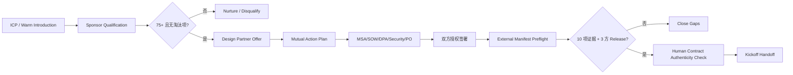

# Stage 18：Design Partner Acquisition & Contracting

本阶段把 Stage 17 的反事实付费 Discovery 资料转成一套可用于真实商机的获取与签约工作台。目标是让团队能够找到一个合适的具名 Design Partner，完成 Sponsor/预算/采购/法务/安全资格确认，并在真实合同签署后安全地把项目交给 Delivery。

公开仓库没有真实客户、联系人、签字、合同、PO 或账单资料。`北辰流体系统`等三个名称均为教学虚构。脚本不会代替授权签字人、法律审阅、采购系统、CRM 或合同系统。

## 运行三条路径

```bash
# 1. 验证公开的合成候选组合
python3 stage18.py demo --check-baseline --output outputs/stage-18

# 2. 在 ignored outputs 中生成一份待填写资料包
python3 stage18.py prepare --output outputs/partner-private

# 3. 用仓库外的真实交易清单做结构预检
python3 stage18.py preflight \
  --manifest /secure/path/design-partner-manifest.json \
  --as-of 2026-09-24 \
  --output outputs/partner-preflight
```

`preflight` 会拒绝仓库内部的清单。真实合同和个人资料应留在组织批准的 CRM、合同、采购、财务和安全系统；manifest 只保存引用、状态、角色与日期。输出目录已被 `.gitignore` 忽略，团队仍应按公司数据政策处理。

## 当前参考结果

- 三个虚构候选中，一个达到 75 分资格线并被选作教学对象；
- 一个进入 nurture，一个因拒绝付费 Discovery 且要求无人审核外发而淘汰；
- 真实具名 Design Partner、外部证据、已执行合同、PO、发票和回款均为 0；
- 状态为 `REAL_PAID_DISCOVERY_NOT_READY`，下一动作是 `ACQUIRE_NAMED_DESIGN_PARTNER`。

评分只帮助团队排序，不能覆盖淘汰项。候选即使超过 75 分，只要要求无人审核自动外发、拒绝付费 Discovery、拒绝流程/数据观察、没有责任 Owner，或要求在未批准路径处理受限数据，就不能进入签约。

## 商业流程



代码检查的是“外部记录是否结构完整”。即使结果为 `READY_FOR_PAID_DISCOVERY_KICKOFF`，也仍需授权人员在权威系统确认签字人、合同版本、法律效力、PO 和账单路径。

## 十项外部证据

1. 客户法律主体核验；
2. Sponsor 权限；
3. Discovery 范围批准；
4. SOW 执行记录；
5. MSA 或适用条款执行记录；
6. 隐私/DPA 决议；
7. 安全路径协议；
8. PO 或等效采购授权；
9. 账单资料核验；
10. Kickoff 资源承诺。

此外需要 FDE Commercial、Legal/Procurement、Delivery 三个角色完成 Release Approval。证据缺失、状态不是 `accepted`、已过期或合同执行声明角色不合法都会阻断。

## 团队分工

| 角色 | 对结果负责 | 不能自行批准 |
|---|---|---|
| Engagement / Commercial Lead | 候选管道、Sponsor、报价、MAP、CRM | 法律效力、数据安全 |
| FDE / Delivery Lead | 问题资格、范围、客户投入、交付可行性 | 客户预算、签字权限 |
| Legal / Procurement | 主体、条款、SOW、签署与 PO 路径 | 技术可行性、业务验收 |
| Security / Privacy | 数据分类、DPA、安全问卷和例外 | 商务折扣、交付验收 |
| Finance | 客户主数据、开票和收款条件 | 范围变更、技术 Gate |
| Customer Sponsor | 业务结果、资源、升级和验收 | FDE 内部安全例外 |
| Customer Process Owner | 流程、样本、专家时间和验收证据 | 合同法律条款 |

## 30 天获取动作

详细节奏见 [Design Partner 获取 Playbook](guides/30-day-acquisition-playbook.md)。团队应先形成 20 个 ICP 账户，获得 8 次 Sponsor 访谈，筛出 3 个合格机会，为 1–2 个客户提交固定范围报价，最终目标是一个真实付费 Discovery。漏斗数字是行动目标，不是虚构业绩；每一步都应绑定 CRM 或会议证据。

## 资料入口

- [Design Partner 报价模板](templates/design-partner-offer.md)
- [Paid Discovery SOW 工作底稿](templates/paid-discovery-sow-term-sheet.md)
- [Sponsor 资格访谈](templates/sponsor-qualification.md)
- [真实签约清单](templates/contract-execution-checklist.md)
- [外部 manifest 示例](templates/external-partner-manifest.example.json)
- [Contract-to-Delivery Handoff](templates/kickoff-handoff.md)
- [30 天获取 Playbook](guides/30-day-acquisition-playbook.md)
- [外部 Deal Room 与证据规则](guides/external-deal-room.md)

## 完成定义

Stage 18 的代码和教学资料完成，不等于商业目标完成。真实阶段只有在以下事实同时成立时才完成：一个真实法律主体愿意作为 Design Partner；双方授权人员执行付费 Discovery 合同；PO/等效授权、账单、安全与隐私路径明确；客户提供 Sponsor、Process Owner 和约定投入；三方 Release 后进入 Kickoff。任何一项都不能由仓库中的合成记录替代。
