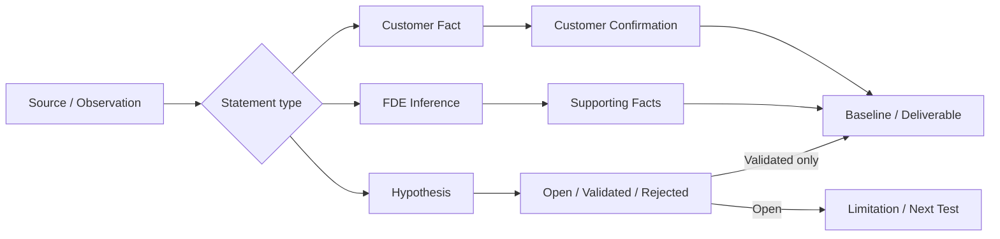

# Stage 19：Live Paid Discovery Execution

本阶段把 Stage 18 的签约准备推进为一条可执行的四周付费 Discovery：合同释放、Kickoff、现场活动、证据登记、基线冻结、依赖与变更、工时成本、六项交付物和客户验收准备。

公开参考分支仍是教学演练，没有真实客户会议、真实数据、客户批准、有效合同、发票或回款。真实项目必须使用仓库外清单，并由授权人员人工确认 Stage 18 合同记录的真实性和法律效力。

## 运行

```bash
# 合成四周执行回归
python3 stage19.py demo --check-baseline --output outputs/stage-19

# 在仓库外创建真实项目工作包
python3 stage19.py prepare --output /secure/path/discovery-execution

# 现场工作完成后进行验收前预检
python3 stage19.py preflight \
  --manifest /secure/path/discovery-execution/external-discovery-execution.json \
  --output outputs/stage-19-preflight
```

参考结果包括八类现场活动、七项合成客户事实、两个 FDE 推断、一个仍开放且未用于结论的假设、五项冻结基线、五项已关闭依赖、两项变更、六项待验收交付物、112 小时和 CNY 95,800 教学成本。状态为 `SYNTHETIC_DISCOVERY_READY_FOR_ACCEPTANCE_REHEARSAL`，真实客户活动仍为 0。

## 四周工作节奏

| 周 | 目标 | 最小产物 | 退出条件 |
|---|---|---|---|
| Week 1 | 共同确认问题、范围和角色 | Kickoff、Sponsor/Process Owner 访谈、当前流程 | Sponsor、Owner、in/out scope 和客户依赖明确 |
| Week 2 | 观察流程和冻结基线 | 流程观察、样本审计、数据安全工作坊、五项基线 | 分母、周期、来源和双方签核冻结 |
| Week 3 | 形成可行方案和商业判断 | 方案工作坊、集成路径、风险、成本和变更 | 每个结论能追溯到事实或明确推断 |
| Week 4 | 完成交付物和 Steering Readout | 六项交付物、成本台账、限制和 Pilot 建议 | 依赖关闭，开放假设不伪装成结论 |

## 机器门禁

- 必须完成 Kickoff、Sponsor 访谈、Process Owner 访谈、流程观察、样本审计、数据安全工作坊、方案工作坊和 Steering Readout；
- 客户事实必须有权威来源和客户确认引用；FDE 推断必须标为 `supported`；假设必须保持 open、validated 或 rejected；
- 五项基线指标必须在方案决定前冻结，保存分母、周期和测量引用，禁止事后改口径；
- Discovery 交付前客户/FDE 依赖必须关闭，批准的变更必须有证据；
- 工时按角色、日期、工作流和加载成本登记；
- 六项交付物必须引用已登记证据，开放假设不能作为结论；
- 真实 manifest 必须在 Git 仓库外，不能含个人姓名、凭证、合同正文、签字或客户基线数值；
- 预检通过只到 `READY_FOR_HUMAN_DISCOVERY_ACCEPTANCE_REVIEW`，不会记录客户接受或授权 Pilot。

## 现场证据层级



## 团队日常操作

1. 每次会议前由 Owner 写明要验证的假设、所需证据和决策；
2. 会后 24 小时内完成 [现场记录](templates/fieldwork-session-note.md)，客户事实发给对应 Owner 确认；
3. Delivery Lead 每日检查证据、依赖、范围和工时，每周使用 [状态模板](templates/weekly-status.md)向 Sponsor 汇报；
4. Week 2 使用 [基线冻结模板](templates/baseline-freeze.md)，未签核的指标不能进入 Business Case；
5. 新要求进入 Change Request，不能直接混入方案或交付物；
6. Week 4 使用 [验收准备模板](templates/acceptance-readiness.md)逐项检查后，再安排客户验收；
7. 客户验收和 Pilot 决定属于下一 Gate，不由 Stage 19 预检自动完成。

## 文件与隐私边界

真实联系人、原始录音/转写、客户样本、指标数值、合同、签字、PO 和凭证留在获批系统。外部 manifest 仅保存角色、引用、状态和日期；预检报告只输出公开标签与不可逆合同引用摘要。CI 只运行合成分支。

## 完成定义

Stage 19 的真实业务目标只有在一个已签约 Design Partner 完成八类现场活动、冻结五项基线、关闭依赖、登记实际成本，并把六项交付物提交给客户验收时才完成。代码和合成演练完成，只说明团队已有执行框架。
