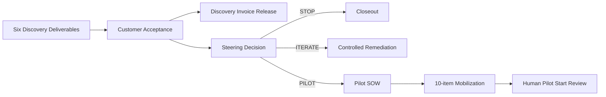

# Stage 20：Customer Acceptance、Pilot Investment Decision & Mobilization

本阶段把 Stage 19 的六项待验收交付物推进为四个相互独立的商业控制：Discovery 客户验收、Discovery 开票条件、Pilot 投资决定、Pilot 启动授权。

参考分支演练了一次“附条件接受 → 两项整改 → 最终接受 → Steering 选择 Pilot”的过程，但 Pilot SOW 仍是草稿，十项 Mobilization 条件均未关闭，所以状态保持 `SYNTHETIC_DISCOVERY_ACCEPTED_PILOT_NOT_AUTHORIZED`。真实客户验收、Pilot SOW、发票、回款、用户和案例均为 0。

## 运行

```bash
python3 stage20.py demo --check-baseline --output outputs/stage-20

python3 stage20.py prepare --output /secure/path/acceptance-investment

python3 stage20.py preflight \
  --manifest /secure/path/acceptance-investment/external-acceptance-investment.json \
  --output outputs/stage-20-preflight
```

真实 manifest 必须在 Git 仓库外，只保存权威系统引用、角色、状态、日期和摘要。客户交付物、合同、发票、联系人、签字及客户业务数值不进入仓库。

## 四个独立 Gate



客户接受 Discovery 不等于同意 Pilot；选择 Pilot 不等于 Pilot SOW 已执行；SOW 已执行也不等于环境和安全条件已满足；机器预检 Ready 仍需要授权人员决定启动。

## 验收控制

- 六项交付物必须逐项绑定 artifact reference、SHA-256、SOW 标准和客户决定记录；
- 验收历史至少包含附条件接受、整改完成和最终接受；
- 每项条件必须有 Owner、期限、关闭证据和关闭日期；
- Acceptance Bundle 由 Customer Acceptance Owner、Customer Sponsor 和 FDE Delivery Owner 绑定同一摘要；
- 任何交付物、条件、历史或标准变化都会使原签核失效；
- 新增范围进入 Change Request，不能包装成“修复未达标交付物”。

## Steering 与 Business Case

Steering 必须在 `STOP / ITERATE / PILOT` 中作出明确决定，并保留反对意见及其处理方式。Commercial、Delivery 和 Security 不能由同一意见代替。

Business Case 同时展示 conservative、base 和 upside 三种情景，并分别保存测量事实和假设引用。参考分支中的 Stage 19 Discovery 实际成本为 CNY 95,800；base 情景年收益 CNY 620,000、Pilot 成本 CNY 480,000、简单净收益 CNY 140,000，全部是教学数值。

## Pilot 独立门禁

Pilot 计划必须包含六类成功指标：字段质量、证据覆盖、危险动作、Operator 采用、审核周期和单案成本。每项都需要冻结分母、目标、基线引用和 Stop 阈值。

启动前必须关闭十项条件：

1. 已执行 Pilot SOW；
2. PO 或等效采购授权；
3. 数据与安全授权；
4. 客户 Sandbox；
5. 企业身份与角色；
6. 只读 Connector；
7. 获批模型与规则；
8. Operator 培训和排班；
9. 遥测与事故路径；
10. 回退与 Stop 演练。

## 团队流程

1. Delivery Lead 依据 [验收会模板](templates/customer-acceptance-meeting.md)逐项展示证据；
2. 条件性问题进入 [整改登记](templates/remediation-register.md)，区分合同缺口与新增范围；
3. Finance 依据 [开票释放模板](templates/discovery-billing-release.md)独立决定发票状态；
4. Steering 使用 [投资决策 Memo](templates/steering-investment-memo.md)比较三种情景和反对意见；
5. 如选择 Pilot，Commercial 使用 [Pilot SOW 工作底稿](templates/pilot-sow-term-sheet.md)进入真实签约；
6. Delivery、Security、IT 和客户 Process Owner 使用 [Mobilization 清单](templates/pilot-mobilization-checklist.md)关闭十项条件；
7. 最终启动决定属于下一阶段的人工 Gate。

## 完成定义

Stage 20 的真实商业目标只有在客户正式验收 Discovery、Steering 作出有证据的决定、财务正确处理开票条件，并在选择 Pilot 时执行独立 Pilot SOW 后才完成。若进入 Pilot，十项 Mobilization 仍需全部关闭；代码不能替代签字人、财务、客户或安全负责人的决定。
