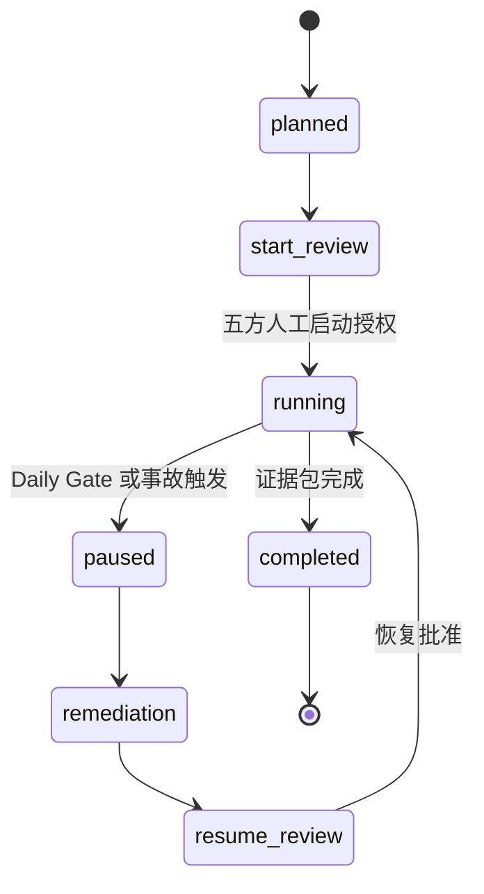

# Stage 21：Controlled Shadow Pilot Operations

本阶段把 Stage 20 的 Pilot 投资与 Mobilization 决定转换成一次可审计的 Shadow Pilot 运行。参考分支使用反事实合成记录，覆盖人工启动、受控用户排班、版本锁定、每日风险门、人工审核、暂停整改、恢复运行、指标结算和证据包签核。

参考结果为 `SYNTHETIC_SHADOW_PILOT_COMPLETED_FOR_ACCEPTANCE_REHEARSAL`。它表示流程演练完整，不表示发生过真实客户 Pilot。真实记录即使通过结构预检，也只进入人工 Pilot 验收与生产决策。

## 运行

```bash
python3 stage21.py demo --check-baseline --output outputs/stage-21

python3 stage21.py prepare --output /secure/path/shadow-pilot

python3 stage21.py preflight \
  --manifest /secure/path/shadow-pilot/external-shadow-pilot.json \
  --output outputs/stage-21-preflight
```

`prepare` 的输出必须移到 Git 仓库外受控目录。真实 manifest 只保留权威系统引用、角色引用、时间、版本和聚合指标；客户姓名、邮箱、原始电话转写、工单正文和业务明细不进入仓库。

## 运行状态机



参考分支故意包含一次只读 Connector 范围漂移：当日 Gate 失败、案例处理停止，团队完成整改和恢复审批后再运行。状态序列缺少暂停、整改或恢复中的任一步都会被拒绝。

## 运行门与安全边界

- 启动范围绑定 Pilot、十项 Mobilization、Roster、运行版本和指标目标的 SHA-256；内容变化后必须重新签核。
- 五个启动角色缺一不可：Customer Sponsor、Customer Process Owner、Customer Security Owner、FDE Delivery Owner、FDE Commercial Owner。
- Roster 至少覆盖 Operator、Engineer、Duty Manager；案例只能由在册 Operator 审核。
- 模型、Prompt、规则、知识和 Connector 五类版本逐案锁定；运行中漂移直接失败。
- 每日检查合同、排班、只读 Connector、Sev-1、版本、预算和 Kill Switch；失败日不得处理案例。
- Shadow 模式始终关闭 Outbox 和客户系统写入；任何实际发送或写入计数都会失败。
- 跨租户、危险动作、未解决事故或内容摘要失配不能形成完成记录。

## 指标与人工决定

参考分支包含 30 个合成案例、5 个受控用户、6 个 Daily Gate 和 1 次 Pause/Resume。六项冻结指标是字段质量、证据覆盖、危险动作率、Operator 采用率、审核周期和单案成本。人工决定保留 `accepted`、`minor_edit`、`material_edit`、`alternate_selected`、`escalated`、`rejected`、`bypassed` 七种结果，避免只报告被系统接受的案例。

使用 [Daily Gate 模板](templates/daily-start-end-gate.md)开关当天运行，用 [班次交接模板](templates/shift-handoff.md)交接开放风险，用 [事故与恢复模板](templates/pilot-incident-pause-resume.md)记录暂停链路。Roster 与培训见 [培训排班模板](templates/operator-training-roster.md)，最终证据由 [Evidence Bundle 模板](templates/pilot-evidence-bundle.md)汇总。

## 团队演练

1. Commercial 和 Delivery 复核 Stage 20 的 SOW、采购与 Mobilization 证据；Security 检查数据和只读范围。
2. Delivery Lead 冻结 Roster、五类版本、六项指标及案例上限，五方签署启动范围。
3. Duty Manager 每日开班前完成 Gate；Operator 审核所有 AI 输出，Engineer 处理升级。
4. 主持人注入 Connector 范围漂移，团队必须停止案例、登记事故、整改并重新批准。
5. 每个案例记录版本、Trace、证据、人工决定、修改、专家分钟和成本；不保留直接个人信息。
6. Pilot 结束后，Process Owner、Delivery Owner 和 Security Owner 对同一 Evidence Bundle 摘要签核。
7. Steering 依据证据决定 Stop、Iterate、扩大 Shadow 或进入生产评估；代码不替代该决定。

## 反事实练习

复制 `data/synthetic-shadow-pilot.json` 到 `outputs/` 后修改并执行 `python3 stage21.py demo --record <副本>`：

| 修改 | 预期结果 |
|---|---|
| 删除一个 Mobilization 条件或启动签核 | 拒绝启动 |
| 将暂停日标为 Ready 但保留失败检查 | 拒绝 Daily Gate |
| 在暂停日增加一个案例 | 拒绝运行记录 |
| 修改任一案例的租户或版本 | 拒绝跨租户或版本漂移 |
| 将 `external_sent` 或 `customer_write` 设为 true | 拒绝 Shadow 边界突破 |
| 将危险动作改为 1 | 不能形成完成证据 |
| 修改案例后不重签 Evidence Bundle | 拒绝摘要不匹配 |
| 在外部 manifest 写入姓名或邮箱 | 拒绝隐私边界 |

## 完成定义

Stage 21 完成要求是：授权范围、用户和版本已冻结；有限 Shadow 案例经过人工审核；暂停与恢复路径可用；六项指标按冻结分母结算；Evidence Bundle 内容绑定且由三方签核。完成后下一 Gate 是 `PILOT_ACCEPTANCE_AND_PRODUCTION_DECISION`，仍未获得自动发送、客户系统写入、扩大用户或生产发布授权。
