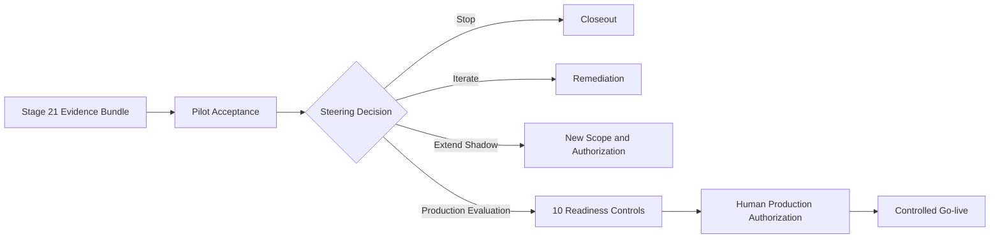

# Stage 22：Pilot Acceptance & Production Decision

本阶段把 Stage 21 的 Shadow Pilot Evidence Bundle 转换成三个相互独立的决定：是否接受 Pilot 结果、是否投资生产准备、是否授权受控上线。

参考分支的六项 Pilot 指标均通过，两项验收条件已关闭，Steering 决定进入 `production_evaluation`；十项生产准备只完成 7 项，威胁模型、生产 SLO、商业与法律条件仍开放，因此状态保持 `SYNTHETIC_PILOT_ACCEPTED_PRODUCTION_EVALUATION_OPEN`，生产、自动外发和客户系统写入均未授权。

## 运行

```bash
python3 stage22.py demo --check-baseline --output outputs/stage-22

python3 stage22.py prepare --output /secure/path/pilot-acceptance

python3 stage22.py preflight \
  --manifest /secure/path/pilot-acceptance/external-pilot-acceptance.json \
  --output outputs/stage-22-preflight
```

真实 manifest 必须保存在 Git 仓库外，只保存权威系统引用、聚合指标、角色、日期、状态和内容摘要。代码只能检查结构和一致性，不能验证客户签字、证据真实性或法律效力。

## 三个独立 Gate



Pilot 指标通过不等于客户正式验收；客户验收不等于同意生产投资；生产准备完成也不等于已经授权上线。

## Pilot 验收

六项指标必须保持 Stage 21 冻结的方向、目标、分母和来源：字段质量、证据覆盖、危险动作率、Operator 采用率、审核周期和单案成本。任何未通过指标都会阻断最终验收。

条件整改需要 Owner、期限、关闭日期和证据；Critical 风险必须缓解。Customer Sponsor、Customer Process Owner 和 FDE Delivery Owner 对同一 Acceptance Record 摘要签核，内容变化后原签核失效。

## Steering 决策

允许四种互斥决定：

- `stop`：关闭 Pilot，不继续投入；
- `iterate`：修复产品、流程或数据后重新评估；
- `extend_shadow`：扩大 Shadow，但必须重新签范围和授权；
- `production_evaluation`：投入生产准备，仍未授权生产。

五方 Steering 必须记录理由、反对意见及处理方式，并绑定 Acceptance 摘要、生产准备清单和 Launch Plan。

## 生产准备十项控制

1. Security Threat Model；
2. Privacy 与 Retention；
3. Data Governance；
4. Identity 与 Access；
5. Reliability SLO；
6. Capacity 与 Performance；
7. Support 与 On-call；
8. Deployment 与 Rollback；
9. Observability；
10. Commercial 与 Legal。

即使十项控制全部 Ready，机器状态也只能到 `READY_FOR_HUMAN_PRODUCTION_AUTHORIZATION_REVIEW`。上线仍需要授权人批准具体版本、时间窗、用户范围和回退责任。

## 团队演练

1. Delivery Lead 使用 [Pilot 验收模板](templates/pilot-acceptance-meeting.md)核对六项指标和所有排除案例；
2. Process Owner 区分验收缺口、新需求和残余风险；
3. Security 与 Delivery 使用 [生产准备清单](templates/production-readiness-checklist.md)关闭十项控制；
4. Steering 使用 [生产决策 Memo](templates/production-decision-memo.md)选择四种决策之一；
5. 风险进入 [残余风险登记](templates/residual-risk-register.md)，Critical 风险不能带入授权；
6. Platform 与 Operations 使用 [上线回退计划](templates/controlled-launch-rollback-plan.md)准备 Canary 和回退；
7. 独立授权人决定是否进入下一阶段受控上线。

## 反事实练习

| 修改 | 预期结果 |
|---|---|
| 将任一实际指标改为未达目标 | Pilot 验收失败 |
| 保留逾期或开放验收条件 | 最终验收失败 |
| 修改风险但不重签 Acceptance Record | 摘要校验失败 |
| 保留开放 Critical 风险 | 阻断生产决策 |
| 删除任一生产准备控制 | 拒绝不完整清单 |
| 修改 Steering 决策但不重新五方签核 | 决策摘要失败 |
| 提前开启自动发送或客户写入 | Launch Plan 被拒绝 |
| 把生产授权设为 true | Stage 22 明确拒绝越权声明 |

## 完成定义

Stage 22 完成表示 Pilot 证据已被逐项验收、残余风险可见、Steering 作出有约束的投资决定，并形成可审计的生产准备与上线回退计划。下一 Gate 是 `HUMAN_PRODUCTION_AUTHORIZATION_AND_CONTROLLED_GO_LIVE`。
